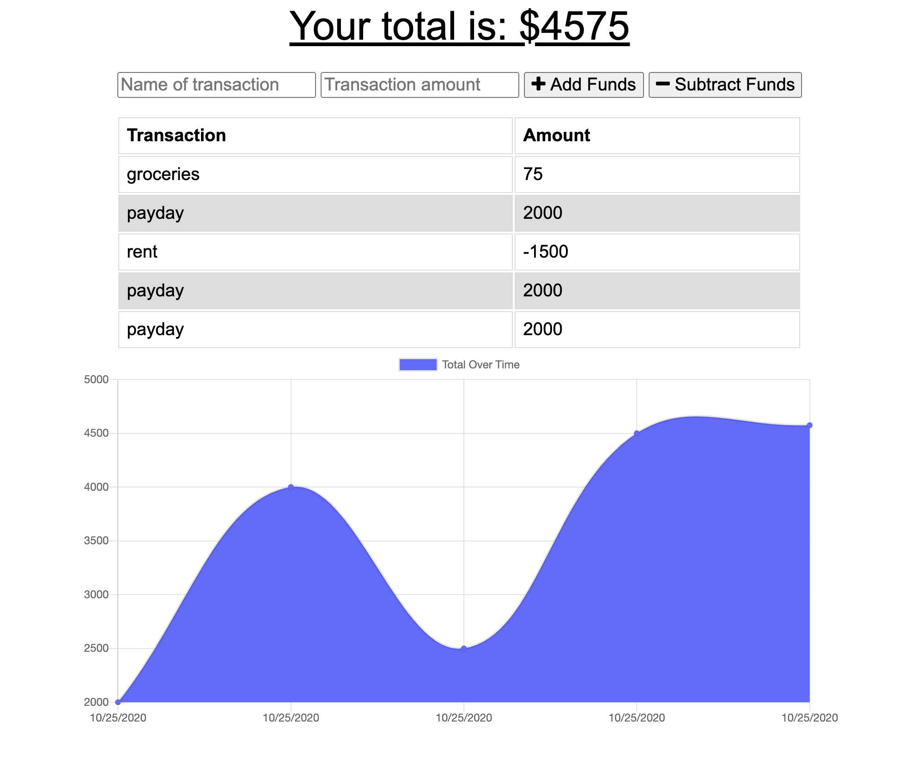

# Budget tracker
An application that allows the user to add expenses and deposits to their budget, with or without a connection. When entering transactions offline, they populate 
the total when back online.

<kbd>

</kbd>

## User Story 
```
AS AN avid traveller
I WANT to be able to track my withdrawals and deposits with or without a data/internet connection
SO THAT my account balance is accurate when I am traveling
```

## Functionality 
```
WHEN I visit the application
THEN I am presented with my current balance, recent withdrawals/ deposites, and a graph tracking my earnings and spending
WHEN I add a new withdrawal or deposit
THEN it updates my total, my recent display, and my tracking visual
WHEN I am offline and want to add a new withdrawal or deposit
THEN that transaction is stored and updates transaction history when my connection is back online
```

## Credits
The starter code of this application was provided by Trilogy Education Services for the JHU Web Development Bootcamp. It uses
[Express](https://www.npmjs.com/package/express), [Node](https://nodejs.org/en/), [MongoDB](https://www.mongodb.com/), [Mongoose](https://www.npmjs.com/package/mongoose/), and [Compress](https://www.npmjs.com/package/compression).

## Other Work
You can see some of my other work at <https://github.com/kimcredit>.    

## License
Copyright (c) 2020 Kim Credit.
